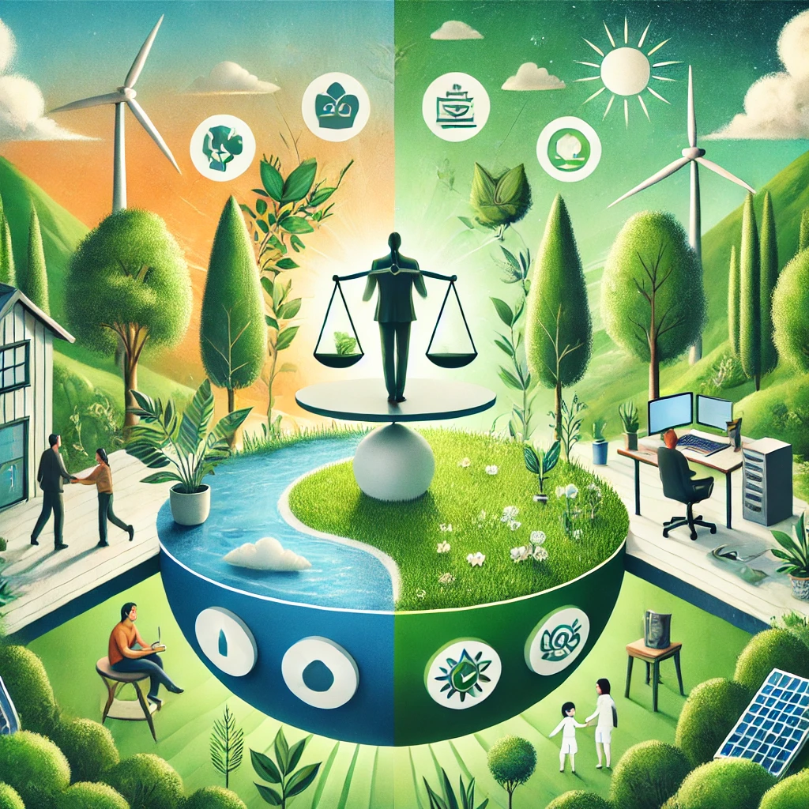
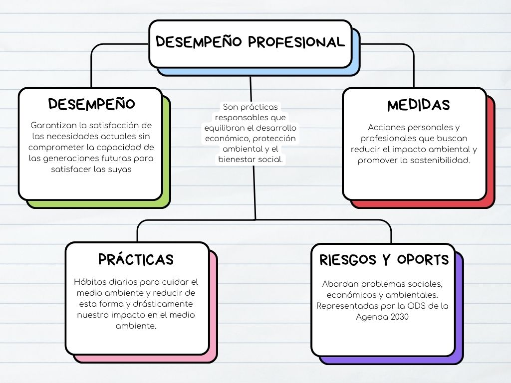

# Desempeño Profesional

--- 
(Imagen Realizada con IA)
## Índice
1.1. [Introducción](introduccion.md)

1.2. [Desempeño profesional y personal](desempeño.md)

1.3. [Riesgos y oportunidades que representan los ODS](riesgos.md)

1.4. [Medidas y oportunidades para atender los retos ambientales desde el entorno personal y profesional](medidas.md)

1.5. [Prácticas sostenibles en ele ambiente personal](practicas.md)

## [Conclusiones](conclusiones.md)
## Mapa conceptual

Herramientas utilizada: Canva
## [Glosario](https://www.canva.com/design/DAGZi817Lt4/KCYOg_SMoZIh33hOJUNFGw/edit?utm_content=DAGZi817Lt4&utm_campaign=designshare&utm_medium=link2&utm_source=sharebutton)
Herramientas utilizada: Canva
## Autores
- Iván Palma Sierra
- Iker Cupillar Aliaga
- Álvaro Moreno Dominguez
