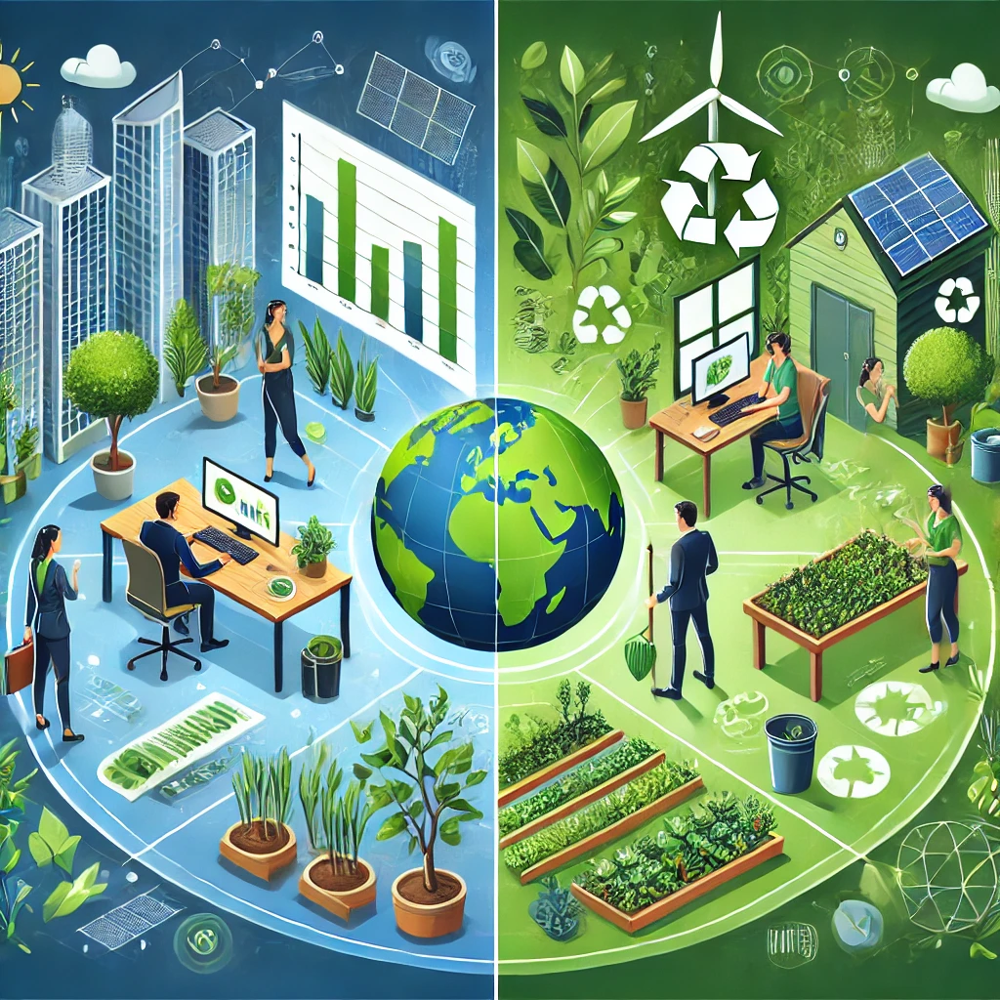

## Desempeño profesional y personal

Básicamente el desempeño profesional y personal consiste en adoptar
prácticas responsables de esta manera se podrá promover un equilibbrio 
entre el desarrollo económico social y ambiental. Esto incluye prácticas,
decisiones y comportamientos que garantizan la satisfacción de las necesidades
actuales sin comprometer la capacidad de las generaciones futuras para satisfacer
las suyas. Y a continuación pondremos un ejemplo de ambos.

* En el ámbito profesional: esto implica impulsar políticas sostenibles, liderar con
  ética, innovar soluciones ecológicas, cumplir normas ambientales y también fomentar
  una cultura sostenible en nuestro trabajo.

* En el ámbito personal: en este ámbito por ejemplo se trata de consumir de manera
  responsable, reducir la huella ambiental, participar en iniciativas comunitarias
  y mantener un estilo de vida que sea equilibrado y consciente.

De esta manera nos aseguraremos de garantizar un impacto menor pero más positivo en
nuestro planeta y nuestra sociedad.

[Imagen generada por IA](https://chatgpt.com/)
[Referencia1](https://www.gadisa.es/blog/desarrollo-profesional-sostenible-como-fomentarlo/)
[Referencia2](https://www.thelemontreeeducation.com/el-mundo-sostenible-a-traves-de-tu-desarrollo-personal/)
