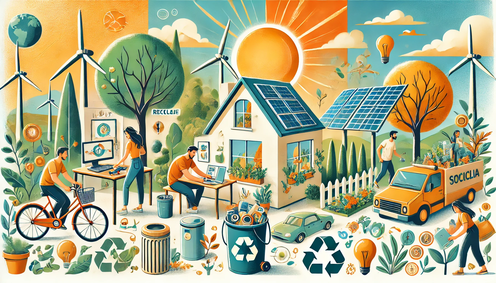

## Medidas y oportunidades para atender los retos ambientales desde el entorno personal y profesional.

Ahora hablaremos sobre las medidas y oportunidades, estas son son acciones personales y profesionales
que buscan reducir el impacto ambiental y promover la sostenibilidad, contribuyendo a resolver problemas 
como el cambio climático y la pérdida de biodiversidad. Y aquí os dejamos algunos ejemplos:

🌱 **Entorno Personal**
* Reducir, Reutilizar y reciclar para evitar desperdicios y separar residuos.
* Un consumo responsable quiere decir elegir productos sostenibles y de comercio justo.
* Uso eficiente de recursos por ejemplo ahorrar agua y energía, y ir en transporte sostenible
  cómo bicis o transporte público.
* Hábitos diarios sostenibles como no usar plásticos de un sólo uso y elegir productos
  ecológicos.

💼 **Entorno Profesional**
* tener políticas sostenibles de esta manera se reducen residuos, se usan más materiales
  reciclables y ahorramos energía.
* tener energías renovables, se invierte en tecnologías y soluciones basadas siempre en
  energías que sean limpias.
* la responsabilidad social corporativa, se podrían desarrollar programas para los empleados
  que estén enfocados en las prácticas sostenibles.

Estos serían muy buenos ejemplos sobre el entorno profesional y personal que ayudarían mucho
al medio ambiente.

[Imagen generada por IA](https://chatgpt.com/)

[ODS - Objetivos Desarrollo Sostenible](https://www.un.org/sustainabledevelopment/es/)
[WWF](https://www.worldwildlife.org/)
[Unión Europea](https://european-union.europa.eu/priorities-and-actions/actions-topic/environment_es)
