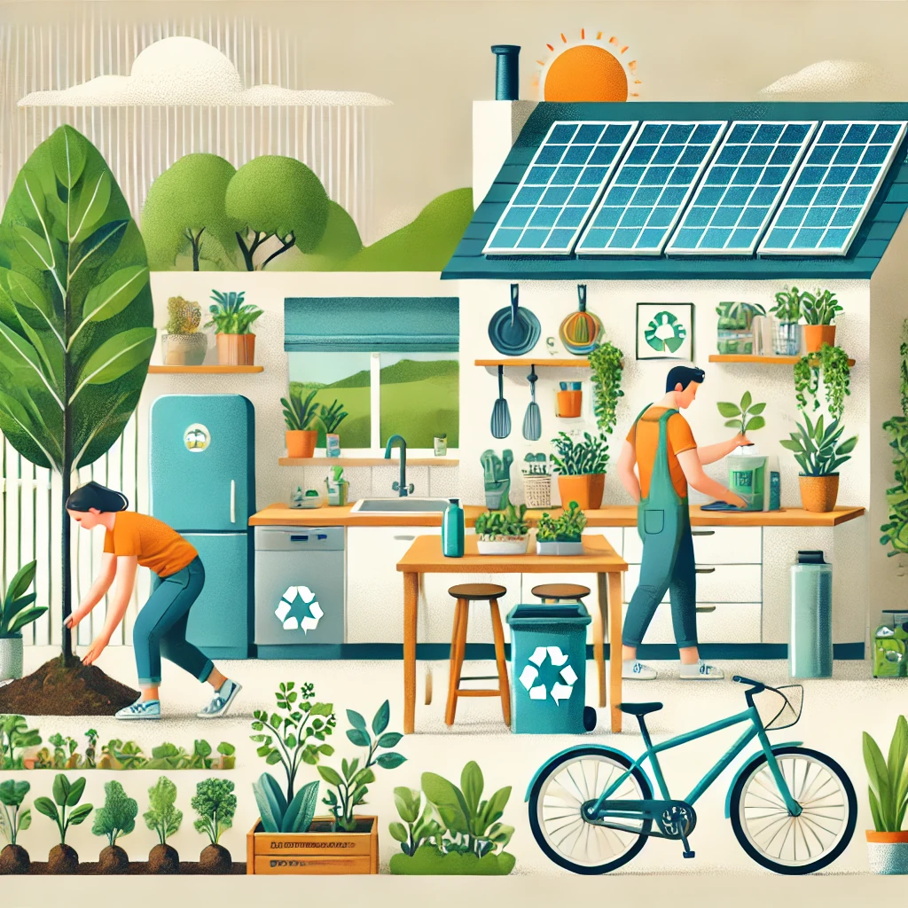

## Prácticas sostenibles en el ambiente personal.

Ahora hablaremos de las prácticas sostenibles en el ambiente personal, que son
y pondremos unos ejemplos claros. Básicamente son aquellos hábitos diarios para 
cuidar el medio ambiente y reducir de esta forma y drásticamente nuestro impacto
en el medio ambiente. Y aquí unos ejemplos:

🌍 **Ejemplos prácticas sostenibles en el ambiente personal**
* Consumo responsable: tenemos que comprar sólo lo necesario, evitar plásticos y elegir
  productos locales o reciclados.
* Reducción de residuos: reduciremos, reutilizaremos y reciclaremos, usaremos bolsas y
  botellas reutilizables y una buena idea sería compostar.
* Ahorro de energía: debemos de apagar luces, usar bombillas tipo LED y aprovechar la
  luz natural.
* Cuidado del agua: tenemos que reducir su uso, reparar todas las fuga y reutilizar el agua.
* Movilidad sostenible: hay que caminar más, usar bicicleta, transporte público y una muy
  buena idea es compartir coche o moto.
* Alimentación consciente: tenemos que reducir el consumo de carne, evitar el desperdicio y
  elegir sobretodo alimentos sostenibles.
* Conexión con la naturaleza: podríamos plantar árboles entre todos, cuidar los ecosistemas
  y muy importante, evitar químicos tóxicos.

Cómo podemos observar estas acciones ayudarán al medio ambiente a reducir drásticamente nuestro 
impacto en el medio ambiente, si todos aplicasemos estas prácticas, el medio ambiente sería más
estable.

[Imagen generada por IA](https://chatgpt.com/)

[SigmaEarth](https://sigmaearth.com/es/20-sustainability-practices-for-work-and-home/)
