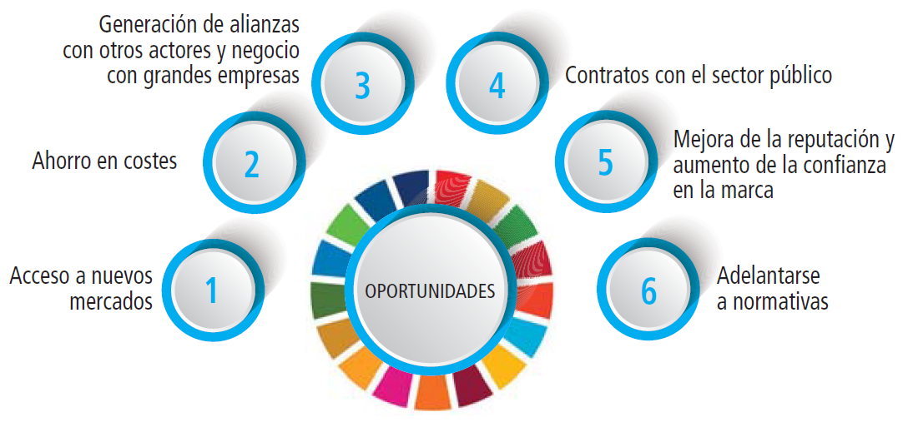

## Riesgos y oportunidades que representan los ODS

Básicamente para resumir los ODS de la Agenda 2030 de la ONU son un
marco global que fué diseñado para abordar problemas sociales, económicos
y ambientales. De esta manera poder implementarlos con éxito y trar consigo
tanto unos riesgos cómo unas oportunidades y de ello hablaremos en este punto 
del tema. A continuación los riesgos y sus oportunidades:

❎ **Riesgos**
* Pude surgir desafíos económicos, desigualdad social y daño ambiental al no
  implementar correctamente los ODS, también la transición a prácticas sostenibles
  puede llegar a ser muy cara y de esta forma generar grandes dificultades para
  pequeñas y empresas medianas.

✅ **Oportunidades**
* Cómo oportunidades nos ofrecen la posibilidad de desarrollar tecnologías innovadoras,
  una gran mejora del bienestar social y nos otorgará una protección en el medio ambiente,
  de esta forma nos garantizará tener un futuro más sostenible y equitativo para las
  próximas generaciones que lleguen al planeta.

[Referencia](https://somosiberoamerica.org/tribunas/agenda-2030-para-el-desarrollo-sostenible-7-riesgos-7-oportunidades/)
  
